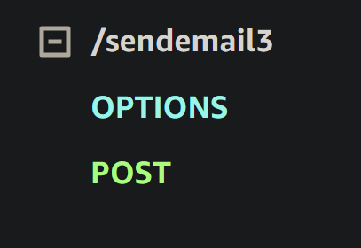

# API Gateway Exercise

In this exercise you will:

1. Create a web API for the Lambda function to send email in the Lambda/IAM exercise
1. Learn to pass inputs to the Lambda function through the HTTP request body
1. Learn to pass inputs to the Lambda function through the HTTP request URL and headers
1. Test the web API internally by calling it from within the AWS environment
1. Deploy the web API
1. Test the web API externally by calling it from outside the AWS environment using Curl or Postman
1. Generate a Swagger file with documentation describing the API.

## Assumptions

The Lambda/IAM exercise has been completed.
 
## [API Gateway Exercise FAQ](./api-gateway-exercise-faq.md)

## Steps

1. Login to the AWS API Gateway Console
    - https://us-west-2.console.aws.amazon.com/apigateway

1. Create a new web API (in the same region that the Lambda from the previous exercise is running in)
    - Click the Create API button
    - On REST API (not private) click "Build"
    - Select New API
    - Specify API name and description
    - Select Regional for Endpoint Type
    - Click "Create API"

1. Next, we will add some resources to the web API. Resources define the URLs that clients will use when calling the web API operations.
    - Select “Resources” on the left side.

1. Add the /sendemail resource to the web API.
    - Click Create Resource
    - Uncheck the box "Configure as proxy resource" if it is checked
    - Fill in Resource Name: sendemail
    - Check the box "CORS"
    - Click the Create Resource button

1. Add a POST method to the /sendemail resource. (This means that clients will use HTTP POST requests to call the /sendemail endpoint.)
    - Select the /sendemail resource
    - Click Create Method
    - In the method type dropdown, select POST
    - If toggled, untoggle  "Use Lambda Proxy Integration"
    - For "Lambda Region" leave it as the default
    - In the lambda function field enter the lambda name.
        - Select the lambda arn, a string that contains the lambda name at the end.
    - If untoggled, toggle  "Use Default Timeout"
    - Click Create Method.
    - The web API endpoint for calling the send_email Lambda function has been created.  This endpoint can be called by using an HTTP POST request that has /sendemail as the URL path and an appropriate JSON object in the HTTP request body (whatever JSON is expected by the send_email Lambda function).

1. Do an internal test of the /sendemail endpoint.
    - Click the rightmost tab Test (the tabs are located slightly towards the middle of the page)
    - In the "Request Body" field, enter a JSON object containing:
        ```
        {
        "to": "TO_EMAIL",
        "from": "FROM_EMAIL",
        "subject": "Test Message",
        "textBody": "This is a test ...",
        "htmlBody": "This is a test..."
        }
        ```
    - Scroll down and click Test.
        - Logs will show up under the Test button once the test is completed.
    - If all went well, an email should have been sent.
        - The email may have been sent to the spam folder.

1. Deploy the API.  This will make it callable from outside the AWS environment by anyone on the Web.
    - In the top right, click Deploy API
    - For the stage, select "new stage".
    - Give the stage a name (e.g., dev) and description
    - Click the Deploy button
    - It should redirect to the new stage in the "Stages" page. The URL for the deployed API should be towards the middle of the page where it says "Invoke URL:"
    - To test your endpoint, you must add "/sendemail" to the end of the URL.

1. Do an external test of the /sendemail endpoint.
    - Using Curl, Postman, or an equivalent tool, call the web API from outside the AWS environment.  Curl is a command-line program that constructs and sends HTTP requests. Postman is a GUI-based tool that does the same thing.  It supports command-line or GUI.
    - To use Curl, do the following:
        - Try running the "curl" command in a shell.  If not installed, download it from https://curl.haxx.se/download.htmlLinks to an external site.
        - Put the request body to send into a text file, e.g., data.txt
        - Run the following curl command to call the web API:
            ```
            curl -d @data.txt -X POST <WEB-API-URL>
            ```
            For example,
            ```
            curl -d @data.txt -X POST https://gqv3z38u0i.execute-api.us-west-2.amazonaws.com/dev/sendemail
            ```
    - To use Postman, do the following:
        - If not installed, download Postman here:
        - https://www.getpostman.com/downloads/
        - In Postman, create a request, select POST as the request type, specify the web API's URL, and in the Body tab select "raw" and enter the request JSON object
        - Click the Send button

    - Note that these options do not test for cors, which will be needed in the tweeter project for the endpoints to work. However, if the instructions were followed, cors should be enabled and working. There will be an options on the gateway resource like so:

        

1. So far we have been specifying the email parameters in a JSON object contained in the HTTP request body.  Next, we will learn how to send parameters in the URL and HTTP headers instead of the request body.  Specifically, the "to" and "from" email addresses will be specified in the URL, and the subject and body text will be specified in HTTP headers named "EmailSubject" and "EmailText".  We will define the URL parameters and HTTP headers used to pass in the email parameters.

1. In the API Gateway console, underneath the /sendemail resource create a sub-resource with the following values:
    - Configure as proxy resource: No
    - Resource Name:  {to}
    - CORS: Yes
    - The curly braces in the path mean that this part of the URL is variable, not fixed.

1. Underneath the /sendemail/{to} resource create a sub-resource with the following values:
    - Configure as proxy resource: No
    - Resource Name:  {from}
    - CORS: Yes
    - Again, the curly braces in the path mean that this part of the URL is variable, not fixed.

1. Add a POST method to the /sendemail/{to}/{from} resource.  (This means that clients will use HTTP POST requests to call the /sendemail/{to}/{from} endpoint.)
    - Select the /sendemail/{to}/{from} resource
    - Click Create Method on the middle of the page.
    - Select POST as the new method type
    - Integration type: Lambda function
    - Use Lambda Proxy Integration: No
    - Lambda Region: accept default
    - Lambda Function: select the Lambda function created in the Lambda/IAM exercise (e.g., send_email)
    - Use Default Timeout: Yes
    - Click "OK" when asked whether or not to give API Gateway permission to call the Lambda function.

1. Next, we need to define the HTTP headers that callers should send to the /sendemail/{to}/{from} POST method. We will define a header named “EmailSubject” that will be used to pass in the email’s subject, and a header named “EmailText” that will be used to pass in the email’s body text.
    - Click Method Request.
    - Click Edit.
    - Expand HTTP Request Headers.
    - Click “Add Header” to create a header and name it “EmailSubject”.
    - Check the Required checkbox.
    - Click “Add Header” to create a header named “EmailText”, and make it required by clicking the Required checkbox.
    - Click save.
    - This tells API Gateway that calls to the /sendemail/{to}/{from} POST method should contain these two HTTP headers that define the email’s subject and body text.

1. Next, we need to map the {to} and {from} URL parameters, as well as the "EmailSubject" and "EmailText" HTTP headers to a JSON object that will be sent to the Lambda function.  This will be accomplished by creating a “mapping template”.  Mapping templates describe how to map the parts of an HTTP request (URL parameters, HTTP headers, etc.) to a JSON object that will be passed to the Lambda function.
    - Click "Integration Request"
    - Scroll down to and expand "Mapping Templates" .
    - Click Create Template
    - Click "Add mapping template"
    - For the Content-Type, enter "application/json" (it looks like it's already there, but it isn't).  This setting means that this mapping template will only be applied to HTTP requests that contain “application/json” in the HTTP Content-Type header.
    - Enter the following text for the "application/json" template:
        ```
        {

        "to": "$input.params('to')",
        "from": "$input.params('from')",
        "subject": "$input.params('EmailSubject')",
        "textBody": "$input.params('EmailText')",
        "htmlBody": "$input.params('EmailText')"

        }
        ```
    - Scroll towards the top and click Edit.
    - For "Request body passthrough", select: Never
    - Click save.

1. Do an internal test of the /sendemail/{to}/{from} endpoint.
    - Click the Test tab.
    - In the Path section, enter values for the {from} and {to} email addresses
    - In the Headers text area, enter the following text:
        ```
        EmailSubject: My Email Subject
        EmailText: My Email Text
        ```
    - Scroll down and click the Test button.
        - Logs will show up under the Test button on completion.
    - If all went well, an email should have been sent.
        - Check the spam folder if the email is not found.

1. Re-deploy the API
    - From the Resources tab click "Deploy API"
    - Select the stage created earlier
    - Click the Deploy button
    - The URL should be the same as before if it is the same stage

1. Externally Test the Web API
    - Using Curl, Postman, or an equivalent tool, call the web API from outside the AWS environment
    - To use Curl, do the following:
        - Run the following curl command to call the web API:
            ```
            curl -X POST -H "EmailSubject: My Email Subject" -H "EmailText: My Email Text" <WEB-API-URL>/<TO-EMAIL-ADDRESS>/<FROM-EMAIL-ADDRESS>
            ```
            For example,
            ```
            curl -X POST -H "EmailSubject: My Email Subject" -H "EmailText: My Email Text" https://gqv3z38u0i.execute-api.us-west-2.amazonaws.com/dev/sendemail/bob@uvnets.com/bob@gmail.com
            ```
    - To use Postman, do the following:
        - In Postman, create a request, select POST as the request type, specify the web API's URL.
        - Include the TO and FROM emails addresses in the URL.
        - In the Headers tab, create the following HTTP headers
            ```
            KEY: EmailSubject VALUE: My Email Subject

            KEY: EmailText  VALUE: My Email Text
            ```
        - Click the Send button
    - (OPTIONAL. This step explains how to generate and use a client SDK in the project. This is NOT REQUIRED for the exercise.) To make it easier to call theAPI from a client program, API Gateway can generate a client SDK that hides some of the details involved in calling the API. Using a client SDK in the project is optional. The alternative is to construct and send custom HTTP requests. To use a client SDK,  generate one for the environment of choice, and incorporate it into the client project.  Client SDKs for the following environments can be generated: Java, Android, iOS, Javascript, Ruby

1. Specify HTTP Status Codes
    - Follow the instructions here: [Mapping Exceptions to Error Codes in API Gateway](./api-gateway-mapping-error-codes.md) under the sections "Specify HTTP Status Codes in Method Response" and "Map Exceptions to Error Codes in Integration Response" to create status codes for 400 with the Lambda error regex of "[Bad Request]" and 500 with "[Server Error]".

1. Add documentation to the API methods.
    - For each method in the API:
        - In the Resources tab, select the method.
        - On the top right, click Update Documentation.
        - Edit the description
        - Click "Save".
    - Go to the Documentation tab on the left-hand panel.
    - All of the descriptions should be displayed.
    - In the upper-right-hand corner, click "Publish Documentation"
    - Select the Stage of the API created earlier.
    - Input any version number for the documentation.
    - Click "Publish"

1. Export the API as a Swagger file
    - Click "Stages" on the left side panel
    - Select the stage created earlier
    - Click "Stage Actions"
    - Click "Export"
    - Click "Export as Swagger"
    - Select either JSON or YAML
    - The file should be generated and displayed in the browser.

## Submission

Submit the generated Swagger file on Canvas.
