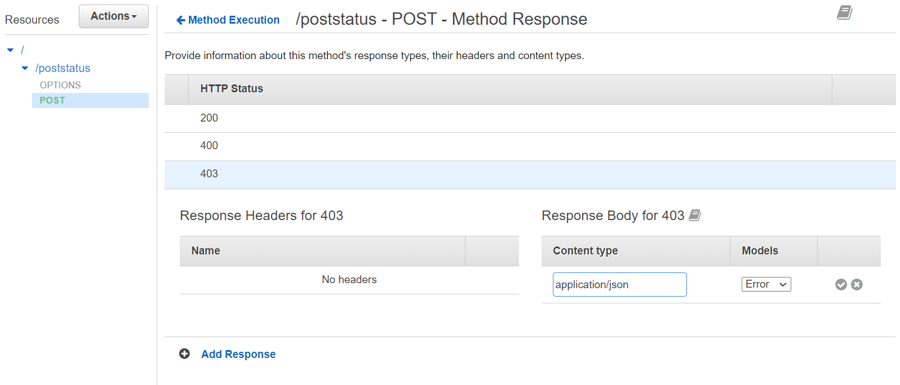
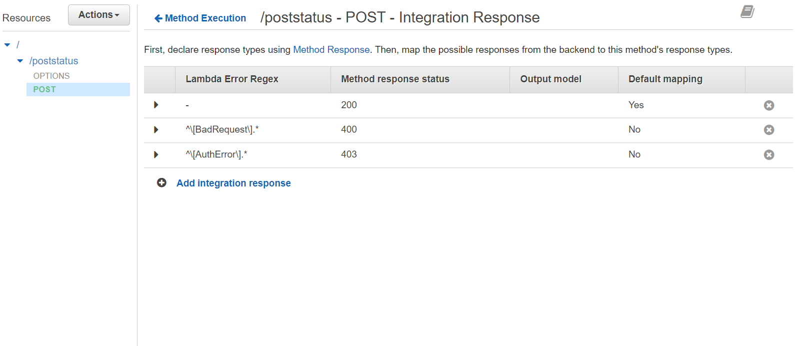

# Mapping Exceptions to Error Codes in API Gateway

HTTP status codes indicate to a client whether a request completed successfully or unsuccessfully. You can view  the standardized status codes for HTTP hereLinks to an external site.. The back-end of your course project should return error codes if they receive invalid requests.

## Throw Runtime Exceptions in Lambda Code

In your Lambda code, throw uncaught Runtime Exceptions. In each exception message, you should begin the message with an identifier to indicate what type of exception occurred.

In the example code below, note the messages passed into the Runtime Exceptions.

```
public class UserService extends Service {

    public GetUserResponse getUser(GetUserRequest request) {

        if (!getAuthTokenDAO().isValidAuthToken(request.getCurrentUserAlias(), request.getAuthToken()))
            throw new RuntimeException("[AuthError] unauthenticated request");

        User user = getUserDAO().getUser(request.getAlias());

        if (user == null)
            throw new RuntimeException(String.format("[Bad Request] requested user %s does not exist", request.getAlias()));

        return new GetUserResponse(user);
    }
}
```

## Specify HTTP Status Codes in Method Response

In API Gateway, you must specify all the HTTP status codes you will return for a resource method on the **Method Response** page. The default status code is 200 (OK). For each error code you intend to use, enter the value of the error code and set the response body's **Model** to the default "Error" model and it's **Content Type** to "application/json".



## Map Exceptions to Error Codes in Integration Response

Once you have specified the response statuses for the method, you can map specific exceptions to response statuses with a **Lambda Error Regex**. API Gateway uses Java-style regular expressions for response mapping (see [Pattern](https://docs.oracle.com/javase/8/docs/api/java/util/regex/Pattern.html)).

In the example below, the regex expression `^\[Bad Request\].*` tells the method to return a 400 status if the string "[Bad Request]" is found in the response at the beginning of a line.  **Note:** The Space between Bad and Request. Make sure it matches your error string, if it has a space or not



## Testing and Debugging

In API Gateway, you can test your status code mappings from the method's **Test** page.

If you do not map exceptions to errors, then API Gateway will return your exceptions with a 200 OK status code.

## Additional Helps

- [Handle Lambda Errors in API Gateway](https://docs.aws.amazon.com/apigateway/latest/developerguide/handle-errors-in-lambda-integration.html)
- [Error Handling Patterns in Amazon API Gateway and AWS Lambda](https://aws.amazon.com/blogs/compute/error-handling-patterns-in-amazon-api-gateway-and-aws-lambda/)
- [HTTP response status codes](https://developer.mozilla.org/en-US/docs/Web/HTTP/Status)
- [Pattern (Java Regex)](https://docs.oracle.com/javase/8/docs/api/java/util/regex/Pattern.html)
