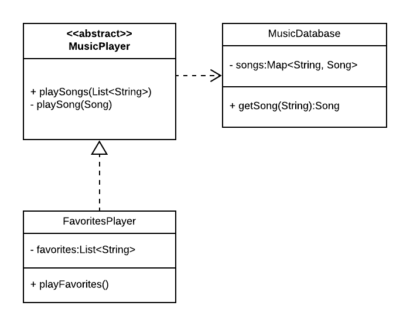

# UML Sequence Diagram Exercise
  
Complete the following exercise using software such as [Lucidchart](https://www.lucidchart.com/) and submit your work on Canvas.

## Diagram Software

For this exercise, you will be creating a sequence diagram, as described in the pre-class readings. Drawing a diagram on paper or a whiteboard can be a great way to help you visualize your application and understand its architecture, but when you present your diagram to others, hand-drawn is not usually what you want; it looks sloppy and unprofessional. Using image editing software (e.g., Microsoft Paint, Photoshop, Gimp) is usually even worse.

Fortunately, there are plenty of diagramming applications out there that you can use to produce readable, professional-looking diagrams. You are free to use any such software that you prefer to create the UML diagrams for this class. If you don't know what to use, we recommend [Lucidchart](https://www.lucidchart.com/), [draw.io](https://app.diagrams.net/), or [sequencediagram.org](https://sequencediagram.org/). Draw.io and sequencediagram.org are free. You can [set up a free Lucid student account](https://help.lucid.co/hc/en-us/articles/360049831771-Sign-up-for-a-free-Educational-account) to get access to all of the features you will need for this class. With sequencediagram.org, rather than drawing the diagram, you describe the intended diagram in a textual format, and the tool generates the visual diagram automatically.

## Description

A music player application has an abstract MusicPlayer class with several concrete subclasses including a FavoritesPlayer class. The MusicPlayer class has a method, playSongs(List<String> songNames), that loops over a list of song names, calling a MusicDatabase class' getSong(String songName) method which loads a single song from a database, then returns a Song which is used by the MusicPlayer class to play the song to the user. Each song is played (by calling the playSong(Song) method) within this same loop, before any other songs are loaded from the database. The FavoritesPlayer class inherits from MusicPlayer, and has an additional method, playFavorites(), which calls its superclass' playSongs method, passing it a previously stored list of song names.

## Sequence Diagram

Using software such as draw.io or Lucidchart, create a Sequence Diagram showing what happens when the user calls playFavorites() on the FavoritesPlayer class. Show lifelines, messages, activations (including self-activations, if any), and interaction frames where applicable.

[We've written a style guide to help you here.](./sequence-diagram-style-guide.md)

## Submission

Submit your diagram to Canvas as a PDF.
