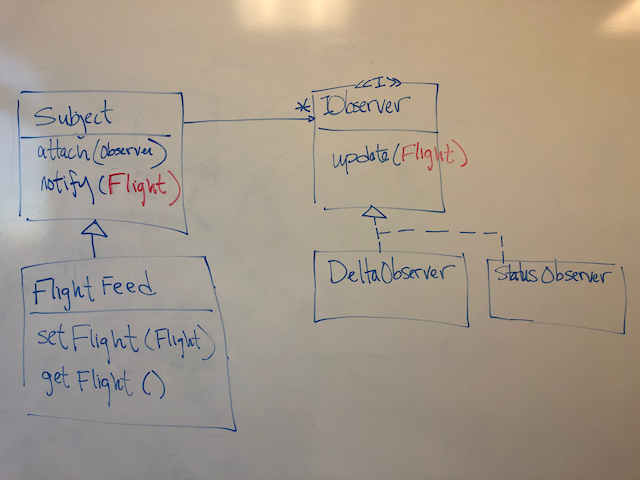

# Introducing the observer pattern exercise

The goal of this exercise is the give you hands on experience with the Observer Pattern. Combined with pre-class reading and in-class discussion we hope this exercise will help you "get-it" in a way that just seeing some slides about it doesn't.

By the end you should have interfaces and/or classes for each role in the pattern:

- Observer interface
- Concrete implementation(s) of the observer interface
- Subject base class (that can be observed)
- Concrete subject

## Introducing the starter code

Before beginning this exercise, please compile and run it. You should see output about a randomly selected flight, with each line being written every minute (if there is updated flight information):

```
id: ab1644, call: UAL1226, country: United States, lon: -114.532700, lat: 47.849400, vel: 246.410004, alt: 7048.500000
id: ab1644, call: UAL1226, country: United States, lon: -114.521797, lat: 47.845798, vel: 247.550003, alt: 7109.459961
id: ab1644, call: UAL1226, country: United States, lon: -114.521797, lat: 47.845798, vel: 247.550003, alt: 7117.080078
id: ab1644, call: UAL1226, country: United States, lon: -114.486801, lat: 47.834099, vel: 248.699997, alt: 7185.660156
```

There are four classes:

#1 **Flight** which is a simple entity class capturing information about a flight

```
public class Flight implements Cloneable {
   public String icao24 = "";
   public String callsign = "";
   public String origin_country = "";
   public int time_position = 0;
   public int last_contact = 0;
   public float longitude = 0.0f;
   public float latitude = 0.0f;
   etc
}
```

#2 **FlightStates** a helper class used by FlightFeed to represent a collection of flights.

```
public class FlightStates {
   public int time = 0;
   public List<Flight> states = new ArrayList<Flight>();  
}
```

#3 **FlightFeed** which does most of the work and (in the starter version) writes updates to the console.

```
public class FlightFeed {
 // A public API used to fetch flight data
 private static final String OPEN_SKY_BASE_URL = "https://opensky-network.org/api/states/all";
 private Flight _flight; // the flight we will be tracking ...
 
 public void start() {
   FlightStates allFlights = getAllFlights();
   
   if (allFlights != null && allFlights.states.size() > 0) {
      // Monitor the first flight returned by Open Sky
      setFlight(allFlights.states.get(0));
      System.out.println(_flight.toString());
   
      while (true) {
         try {
            final int UPDATE_DELAY_MILLIS = 60 * 1000; // one minute
            Thread.sleep(UPDATE_DELAY_MILLIS);
         }
         catch (InterruptedException ex) {
            return;
         }
         
         // Get latest flight info
         Flight newFlight = getSingleFlight(_flight);            
         
         if (newFlight != null) {
            if (!_flight.equals(newFlight)) {
               // Flight info changed
               setFlight(newFlight);              
               System.out.println(_flight.toString());
            }
         }
         else {
            // Flight disappeared from the data feed         
            setFlight(null);
            System.out.println("Flight Over");
            
            return;
         }
      }
   }

   etc
}
```

#4 **FlightMonitor** which is the entry point to the program

```
public class FlightMonitor {
   public static void main(String[] args) {
      FlightFeed feed = new FlightFeed();
      feed.start();
   }  
}
```

The problem with **FlightFeed** is that it is inflexible with how it provides updates and what updates it provides, limiting the usefulness of the class. It just writes to the console. What if we want to use it in a GUI application, for example? 

**We want to use the observer pattern to add a level of independence between FlightFeed and whatever behavior is to happen when there are updates.** The FlightFeed will be the concrete subject that inherits from a subject base class. Two new concrete observers will write to the screen when they receive updates.

See step by step instructions here: [Observer Exercise](./observer-exercise.md)

Demonstrate how to start a new project from existing source code in IntelliJ.

## Partial exercise solution

### Add an Observer class that is at least:

```
public interface Observer {
  public void update();
}
```

### Create a Subject base class that is at least:

```
public abstract class Subject {
  ArrayList<Observer> observers = new ArrayList<Observer>();

  public void register(Observer observer) {
    observers.add(observer);
  }

  public void updateObservers() {
    for (Observer o : observers)
      o.update();
  }
}
```

### Update FlightFeed to update any observers that are registered.

```
private void setFlight(Flight value) {
  _flight = value;
  updateObservers();
}
```
 
### Create two observers (I called mine FlightStatusReporter and FlightDeltaReporter). Here is one of them:
 
``` 
public class FlightStatusReporter implements Observer {
  FlightFeed feed;

  public FlightStatusReporter(FlightFeed feed) {
    this.feed = feed;
    feed.register(this);
  }

  public void update() {
    Flight flight = feed.getFlight();
    if (flight != null)
      System.out.println("STATUS: " + flight.toString());
    else
      System.out.println("STATUS: no flight");
  }
}
```

## Push vs Pull

The above partial solution assumes the pull variant of the observer pattern, as illustrated here:
 

 
An important alternative is the push model, where the notify and update methods take an argument of type Flight.
 

