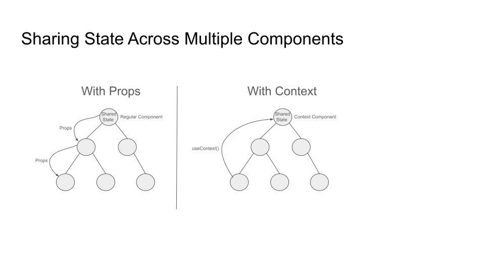

# useContext

## The problem

Without context, if you want to pass data deeply:

```
<App>
  <Page theme="dark">
    <Header theme="dark">
      <Toolbar theme="dark">
        <Button theme="dark" />
      </Toolbar>
    </Header>
  </Page>
</App>
```

Even if only Button cares about theme, you’d have to pass it down through every intermediate component.

## React Context

React context can be used to avoid passing shared state down the component tree through props.

A "context" allows state to be shared across part or all of a component tree.



## Using Context

1. Create the context

```
import React, { createContext, useContext, useState } from "react";

const ThemeContext = createContext();
```

2. Provide the context

The "context" contains a "provider" component that is used to wrap the components that need to access the context.

The "provider" component's `value` attribute is initialized with the shared state.

The shared state can be any value, including an object, function, or scalar.

```
function App() {
  const [theme, setTheme] = useState("dark");

  return (
    <ThemeContext.Provider value={theme}>
      <Toolbar />
    </ThemeContext.Provider>
  );
}
```

3. Consume the context

Components within the context can directly access the context's shared state by calling `useContext`.

```
function Toolbar() {
  return (
    <div>
      <ThemedButton />
    </div>
  );
}

function ThemedButton() {
  const theme = useContext(ThemeContext); // ✅ access context value
  return <button style={{ background: theme === "dark" ? "#333" : "#eee" }}>Click</button>;
}
```

## Common Uses of Context

- Themes (light/dark)
- User authentication info
- Language/locale
- Global settings (e.g. app-wide config)

## Context in Tweeter

Tweeter uses React context to:

### Globally share user info

- `UserInfo.ts`
```
export interface UserInfo {
    currentUser: User | null;
    displayedUser: User | null;
    authToken: AuthToken | null;
}
```
- `UserInfoContexts.tsx`
```
export const UserInfoContext = createContext<UserInfo>({} as UserInfo);
```

### Globally share functions for updating user info
- `UserInfoContexts.tsx`
```
interface UserInfoActions {
    updateUserInfo: (currentUser: User, displayedUser: User | null, authToken: AuthToken, remember: boolean) => void,
    clearUserInfo: () => void,
    setDisplayedUser: (user: User) => void,
}

export const UserInfoActionsContext: Context<UserInfoActions> = createContext<UserInfoActions>(defaultUserInfoActions);
```

### Globally share list of currently displayed "toast" messages
- `Toast.ts`
```
export interface Toast {
  id: string;
  title: string;
  text: string;
  type: ToastType;
  expirationMillisecond: number;
  bootstrapClasses: string;
}
```
- `ToastContexts.ts`
```
export const ToastListContext = createContext<Toast[]>([]);
```

### Globally share functions for modifying toast list
- `ToastContexts.ts`
```
interface ToastActions {
  displayExistingToast: (toast: Toast) => void,
  displayToast: (toastType: ToastType, message: string, duration: number, title?: string, bootstrapClasses?: string) => string,
  deleteToast: (_toast: string) => void,
  deleteAllToasts: () => void,
};

export const ToastActionsContext = createContext<ToastActions>(defaultToastActions);
```

### Providing Context

Expanded `index.tsx`

```
root.render(
  <UserInfoContext.Provider value={userInfo}>
    <UserInfoActionsContext.Provider value={userInfoActions}>
      <ToastListContext.Provider value={toastList}>
        <ToastActionsContext.Provider value={toastActions}>
          <App />
        </ToastActionsContext.Provider>
      </ToastListContext.Provider>
    </UserInfoActionsContext.Provider>
  </UserInfoContext.Provider>
);
```

### Consuming Context

Any wrapped component can directly access the state in these contexts:

    const { currentUser, authToken } = useContext(UserInfoContext);

    const { clearUserInfo } = useContext(UserInfoActionsContext);

    const toastList = useContext(ToastListContext);

    const { displayToast } = useContext(ToastActionsContext);
