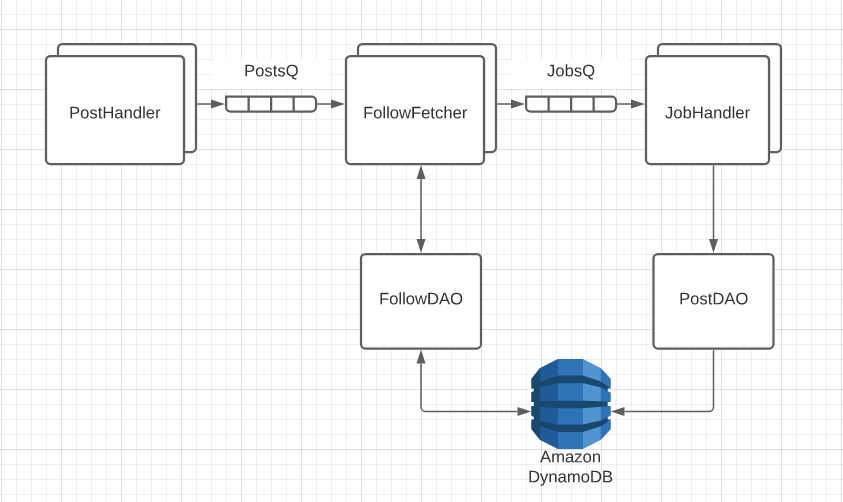

# Milestone 4 FAQ

## General

See [Milestone 3 FAQ](../milestone-3/milestone-3-faq.md) for various server-related and other errors that could still affect this milestone.

### How can I avoid paying way too much for AWS?

In short, make sure that you have the right settings for DynamoDB. You can read about those settings [HERE](../project-overview/aws-account.md).

### My lambdas are really slow?

Make sure that your lambdas are only creating a single AmazonDynamoDB client. For example, the difference between the following two functions:

*Note that this example is in Java, but you can do something similar in TypeScript.

```
private AmazonDynamoDB getClientBad()
{
    client = AmazonDynamoDBClientBuilder.standard()
            .withRegion(REGION)
            .build();
    return client;
}
private AmazonDynamoDB getClientGood()
{
    if (client == null)
    {
        client = AmazonDynamoDBClientBuilder.standard()
                .withRegion(REGION)
                .build();
    }
    return client;
}
```

### Cannot read properties of undefined (reading '0') when calling DynamoDB.

Sometimes this error happens when getting imports mixed up for client-dynamodb and lib-dynamodb. The error means that the request is malfmormed. lib-dynamodb is a module that depends on client-dynamodb but makes creating queries a little simpler.

### No errors are thrown but not all items are returned

Sometimes a batchwrite doesn't write all the items. The unprocessedItems can be retrieved from the response, resp.unprocessedItems, and rewritten in a loop until there are zero unprocessed items. [The sample code for creating 10,000 followers](./dynamodb-batch-write-example.md) uses this technique.

When a lambda is triggered by an SQS, make sure to handle all the SQS requests that it receives. By default a lambda can take 10 items, or records, from an SQS, so make sure to loop through and handle all the event.Records.

## Milestone 4A

### Can I use AWS's time to live feature to expire timestamps?

Yes, if you would like to. However, the code should still check if the token is expired. TTL might not delete tokens for several days. It solves the problem of preventing the table from being cluttered with old tokens, but it does not delete tokens immediately when they expire and so it doesn't count as validating token expiration.

### How do I Put Data In My Tables?

Refer to your DynamoDB in-class exercise, if you want to use TypeScript code to put data into your tables.

Alternatively, this can all be done with the App. Once done, you can easily Register new Users. Post Status should also work, and load into Feeds and Stories (though it won't fulfill M4B requirements). Followers and Followings are the hard(er) part, but are also easy to do. When posting a status, add a tag (@user), then click on that tag and follow them. Note, that you shouldn't need much for M4A, but you should have enough data to show off pagination.

### Why won't my S3 bucket load?

Make sure your bucket doesn't have a '.' in the bucket name.

### How do I upload my image to S3?

In order to upload your image string to S3, you will need to convert the string to a byte array and send the request to S3 using a Put Object Request. You can do this using the following code:

```
  async putImage(
    fileName: string,
    imageStringBase64Encoded: string
  ): Promise<string> {
    let decodedImageBuffer: Buffer = Buffer.from(
      imageStringBase64Encoded,
      "base64"
    );
    const s3Params = {
      Bucket: BUCKET,
      Key: "image/" + fileName,
      Body: decodedImageBuffer,
      ContentType: "image/png",
      ACL: ObjectCannedACL.public_read,
    };
    const c = new PutObjectCommand(s3Params);
    const client = new S3Client({ region: REGION });
    try {
      await client.send(c);
      return (
      `https://${BUCKET}.s3.${REGION}.amazonaws.com/image/${fileName}`
      );
    } catch (error) {
      throw Error("s3 put image failed with: " + error);
    }
  }
  ```
  
image_string is the string of bytes that should be getting passed to your server code. Swap the name "student-bucket" with your S3 bucket name in both the URL and PutObjectRequest. Swap region-name in the URL with the region your S3 bucket is created in. Additionally, you may need to change a couple of settings in your S3 bucket to get this to work. Ensure the following settings are changed so your S3 bucket has public access:

Permissions -> Block Public Access needs to block nothing.
Permissions -> Object Ownership needs to allow ACLs.

Make sure that your register lambda also has full access to S3 by going to configuration->permissions and viewing the lambda role.

How do I have one user follow another?
You could either do this through code that generates two users and sends a follow request with the two new aliases. If you'd rather do this without writing code, you can also register two users, log into one of them, and tag the other user in a new post. Once the post is in the user's story, you can click on the tag to pull up the other user and hit follow. So for example, if you had @userA and @userB, @userA could make a post like this:

"hello @userB"

Clicking on @userB will take you to their profile if you've coded your get user function correctly.

### How should I get the number of followers/following for a User?

We highly recommend that you store the number of followers and following as fields in the User table. When a user follows another user, you can add that entry in the follows table, fetch the user objects for the follower and the person they are following, and update their follow/following values accordingly. This will be much faster than fetching all followers/following and counting them in real time.

### How do I query the follow table by both followers and followees?

You need to set up an Index for the table, as described in the [DynamoDB Exercise](../../instruction/cloud-datastore-dynamodb/dynamo-db-exercise.md).

## Milestone 4B

### How do I get 10,000 followers in my database to test the performance requirements?

There are instructions on how to do this [HERE](./dynamodb-batch-write-example.md).

### What is a good back-end architecture for making posts?

While there are other ways to meet the speed requirements, we recommend using two SQS Queues and adding some Lambdas.  Doing this will help by utilizing the interaction between the Queues and Lambdas.  For each item at the head of the Queue, a new instance of the Lambda will be "spun up" to process it (up to some limiting count of instances).
The PostHandler just deposits posts in the PostQ, and then lies to the client that the job was done.  The FollowFetcher retrieves a list of all of the posting user's followers, chops the list into "jobs", and then puts each job in, you guessed it, the JobQ.  The JobHandler then shoves the posts into each follower's Feed.



### Thoroughput exceeded, dynamodb throttled

If there are too many concurrent lambdas, the 100wcu on the feed table may be exceeded. Calculate how many concurrent lambdas there are, and how many items are being written at a time. If there are 100 lambdas batchwriting 25 items at the same time, this may exceed the WCU. 

Note that by default (this setting can be changed in the lambda -> configurating -> Triggers section), one lambda can receive up to 10 messages from the queue. Thus, if 10 messages are sent to the queue each with 1,000 followers, it is possible that only one lambda will be called with all the items.

There is a setting for 'max concurrency' on the lambda trigger that limits the number of lambdas called at one time by the queue. This can be found by going to lambda -> configuration -> Triggers, checking the box for the trigger and clicking edit.

If thoroughput is exceeded, make sure to purge the queues of messages. Otherwise lambdas will continue running, timeout and get sent back to the queue, and get called again in a loop. They will thus continue to throttle the table.

When purging the queue, it does not get rid of lambdas currently in deployment, so don't be surprised if some lambdas still run after purging the queue. To purge the queue entirely, you may need to disable the lambda trigger, wait for however long the lambda timeout is, and then purge the queue.

### The test does not wait for my success toast

Even if a function is awaited, there may be somewhere down the line that an async function is not awaited. All async functions must be properly awaited for things to work as expected.

A work-around that might fix it is to wait for a couple of seconds:

```
await new Promise((f) => setTimeout(f, 2000));
```
