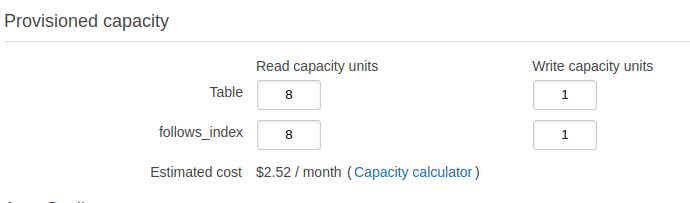

# AWS Account

## Normal Account (required)

In this class we make heavy use of Amazon Web Services (AWS), which is Amazon's cloud platform.  AWS provides a "free-tier" account that provides free, limited access to some AWS services for one year. 

To prepare for this class, sign up for a normal AWS Account.

We don't expect that you will be charged for this class - all exercises and milestones can be completed well within the free tier. The section at the bottom of this page talks about a few gotchas that AWS has and where you may accidentally end up spending a small amount.

## AWS and Money

When working with AWS, you have a lot of opportunities to (accidentally) spend money. Here are some notes to make sure you don't spend a ton of it.

### DynamoDB

#### Capacity

**Danger: High**

The Free Tier for AWS allows for a total of 25 Read capacity units and 25 write capacity units. Your Dashboard will show you have many you have used. Anything more than that will be charged. Remember that your indexes will also use capacity units.

For Milestone 4, you may need to increase these past the 25. If you do this and then shrink back down to within Free Tier limits within an hour, you may not be charged. We expect the charge for Milestone 4 to be well under $1 if you have a good solution.

This can get expensive real quickly if you are not careful.
 
#### Alarms

**Danger: Low**

Each time you create or modify a table, AWS might recreate Alarms. The Free Tier allows for 8 alarms. You will exceed this if you have more than 2 tables. Remember to clear them!

You will probably get charged a few cents a month if you forget.

#### Dax

Do not use this for your project. There is no credit for solutions that have this. There is no free tier. 

### Lambda

**Danger: Low**

You get 1 million requests per month and over 1,000 hours of compute time. It will be hard to exceed this. You should consider setting smaller timeouts for your lambdas that you expect to be quick to ensure you don't have large compute times, especially in preparation for testing for Milestone 4 where a bulk operation failure could cause a lot of resources to be used if it cascades. Review your retry policies to ensure that a cycle cannot happen or lots of useless duplicate calls don't happen.

### SQS

**Danger: Low**

You get 1 million requests per month. You are likely going to use under this. Milestone 4 might see a much higher percentage used. If you exceed this for that milestone, it should be fairly cheap still (a couple cents a month).
